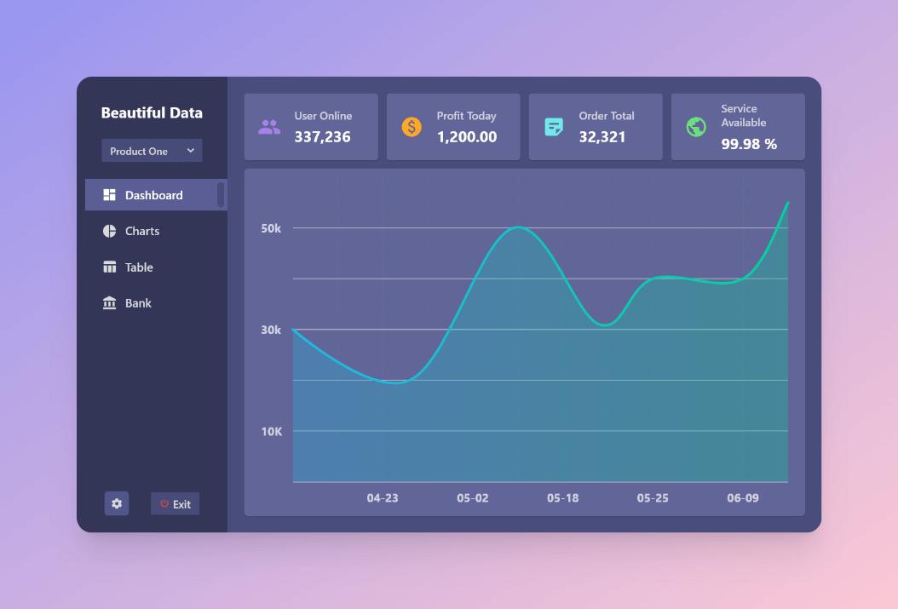
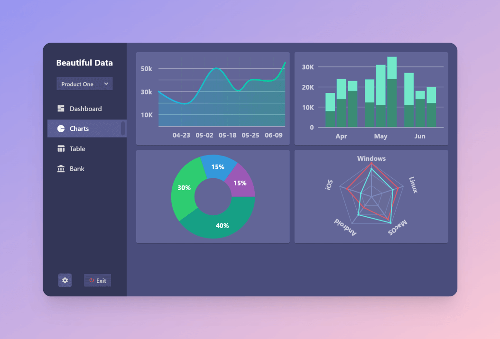
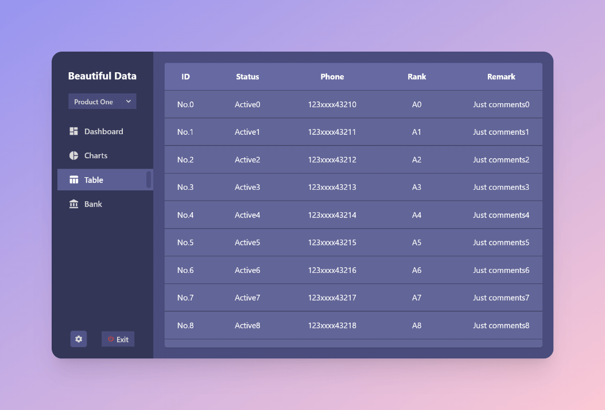

# beautiful_desktop_data_ui

A Flutter desktop project focus on building great modern UI for common data.

## Screenshot

## About

Just several UI examples, no animations and business logic. Write for fun.

## License

[MIT](./LICENSE)

&nbsp;

😜

A little project by <a href="https://github.com/NeroSong">@NeroSong</a>

